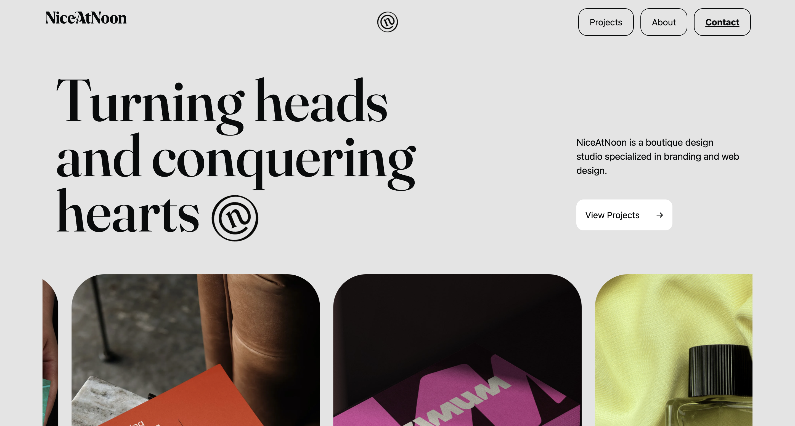
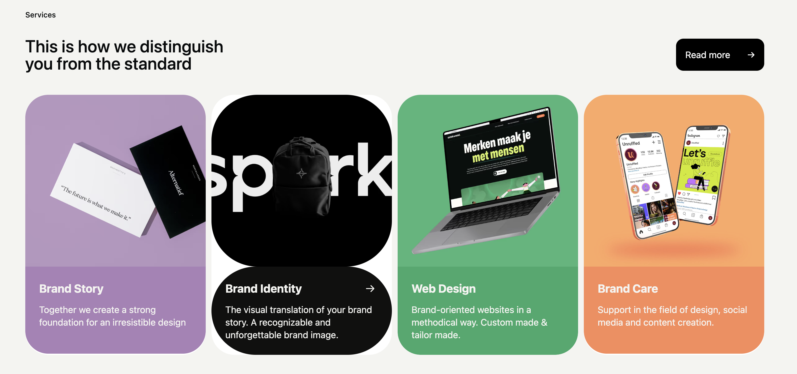

# 🎨 NiceAtNoon Website Clone

A pixel-perfect front-end clone of the stunning [NiceAtNoon.nl](https://www.niceatnoon.nl/) website — built with 💖 using **HTML** and **Tailwind CSS**.


---

## 🚀 Live Demo  
👉 [Click here to visit the live site](https://codex047.github.io/niceatnoon-clone/)

---

## ✨ Features
- ⚡ Fully responsive layout (optional)
- 🎯 Tailwind CSS utility-first design
- 🖼️ Smooth image scroll animation
- 🔁 Hover zoom, button underline, scroll-based fade-ins
- 💅 Clean and modern UI just like the original

---

## 📸 Screenshots

| Home View | Hover Interaction |
|-----------|-------------------|
|  |  |

---

## 🛠️ Built With
- **HTML5**
- **Tailwind CSS 4 (CLI)**
- 💖 Love for clean design

---

## 📁 Folder Structure
```bash
NiceAtNoon/
├── index.html
├── style.css
├── images/

```
---

## 🧠 What I Learned
- Mastered advanced Tailwind animations and layout
- Implemented scroll-based and hover interactions
- Practiced precision cloning and component design

---

## 🙌 Special Thanks
Inspired by the minimalist brilliance of [NiceAtNoon](https://www.niceatnoon.nl/). This project is built **just for learning and practice** purposes.

---

## 📬 Connect With Me
- 💼 [LinkedIn](https://www.linkedin.com/in/vishal-ravindra-patil/)
- 🐙 [GitHub](https://github.com/CodeX047)

---

## 📌 Note
> This is a **frontend-only clone** and not affiliated with the original creators.

---
